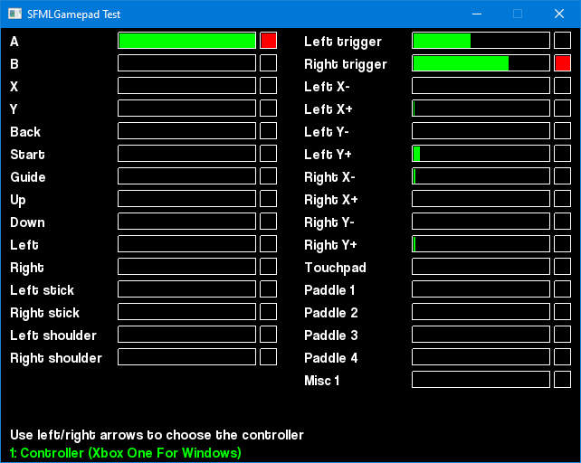
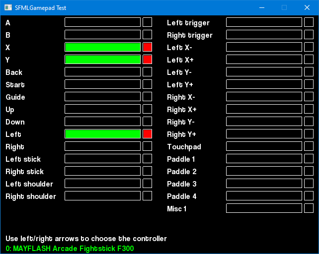

# SFMLGamepad

SFMLGamepad adds support for SDL gamepad controls mapping database to the SFML : instead of
meaningless button and axis indexes, controls are identified by names like A, B, Start, Left, etc.
On Windows systems, XInput is used to handle the gamepad triggers.

The API is similar to that of sf::Joystick, with a slightly different behavior.

### Controller detection

A sf::Joystick can be connected while there is no entry in your database, making the corresponding
sf::Gamepad unavailabe:

|                         | Joystick connected                                       | Joystick not connected   |
|-------------------------|----------------------------------------------------------|--------------------------|
| **Gamepad available**   | Controller connected and mapped                          |             /            |
| **Gamepad unavailable** | Time to update the database with your unknown controller | Controller not connected |

### Analog/boolean controls

Each control can be used as a button or as an axis. If the control is an analog one, then using
isPressed() will return true if the value is above a threshold, false other wise. If it is a two-states one,
getPosition() will return 0 when released and 1 when pressed.

### Axes

Axes with positive and negative directions appears as two axes, like LeftXPlus / LeftXMinus for the left joystick, horizontal axis.

## Loading a database

It is possible to load several databases, for example using an embedded string and a user file.

## Status

* Untested on following platforms : macOS, iOS, Android.
* The reference database provides similar products with different revision IDs, but the SFML provides no way to dinstinguish between them.
* THe reference database contains axis with values > 6, they are not handled

## Links

* [SFML website](https://www.sfml-dev.org/)
* [SFML repository](https://github.com/SFML/SFML)
* [SDL game controller database](https://github.com/gabomdq/SDL_GameControllerDB)
